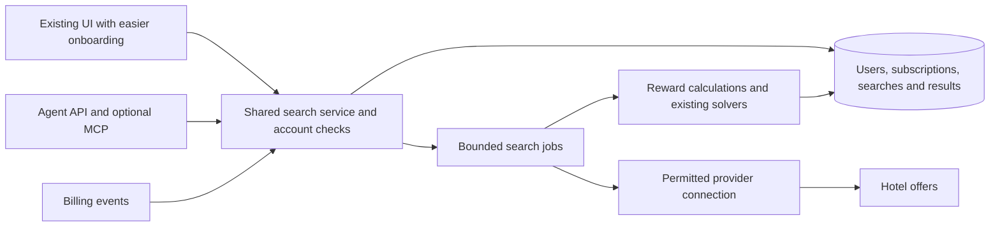

**Incremental plan: polish and monetize the working optimizer**

This plan builds on a working product Brad used extensively to reach Executive Platinum, with positive Reddit feedback. The main reported friction is acquiring/pasting cURL. The goal is to expand, polish and monetize that app, including agent access, while assessing further product opportunities on their own merits. The plan does not require a new frontend, a replacement optimizer, or a larger travel product before a paid beta.

**The product promise**

“Find better AAdvantage Loyalty Point value by comparing hotel bookings and dates for you.”

Keep both existing applications: splitting bookings for a trip the customer is taking, and finding high-value bookings to close a status gap. The latter includes Brad's phantom-stay use case, with a clear distinction between a quoted reward and verified conditions for earning it. Do not hide useful broad search or single-night splitting because a different travel workflow might be simpler to build.

Sell saved effort and better booking comparisons. Show the price, estimated qualifying LP, LP per dollar, booking count and exact dates. Separate redeemable miles from LP. Retain the ability to inspect underlying options and assumptions. “Best found” should refer to the coverage actually searched, not an unverified global optimum.

**First milestone: remove cURL from onboarding**

There are two logins: the customer's account in this paid app, and the hotel-provider session needed for personalized rewards. They need distinct security boundaries but should feel like a short, coherent onboarding flow.

1. Sign in to the optimizer with a familiar managed sign-in method, email link, or passkey.
2. Select “Connect AAdvantage Hotels.” If a valid connection already exists, skip this step.
3. Complete any provider login/MFA on a provider-controlled page. Return to a visible connected state. Never ask the customer to open DevTools or copy a token.
4. Search using the existing workflow. Reconnect only when necessary; preserve the unfinished search so the user can continue.

Implement a small connection proof before committing to its UI. It must verify whose account is connected, whether personalized rewards are available, expiry/reconnection behavior and the permitted search method. An ordinary web page cannot simply read another site's logged-in browser session. An AA Hotels SSO button on the provider's own site does not demonstrate a public OAuth integration available to this app.

| Connection route | Customer experience | What must be proven |
|---|---|---|
| Authorized provider integration | Connect once in a hosted redirect flow; searches can run in the service | Commercial permission, access to AA-specific personalized rewards, supported auth/refresh, rate limits and link/booking rights |
| Small browser companion, if permitted | One-time extension install; log in normally on AA Hotels; search without copying cURL | Reliable supported browser flow, narrow permissions, account/session detection, correct reward quotes, provider permission, store distribution and a clear mobile limitation |
| Customer-specific hosted browser, only if needed and permitted | Provider login in an isolated interactive session | Safe MFA handoff, strict user isolation, session storage/expiry, provider acceptance and acceptable per-user cost; this is a more expensive fallback |

The browser-companion route is the closest technical successor to the current copy-cURL workflow and worth a bounded feasibility spike if a direct integration is unavailable. Prefer leaving the AA session inside the customer's browser and returning structured quote data. Avoid designing the product around exporting a full browser cookie jar to the server. If the permitted design truly requires server-held session material, explicitly minimize its scope, encrypt it, isolate it per customer, redact all logs, and support disconnection/deletion. It cannot be described as “cookies never leave your browser.”

Content scripts require deliberate permission and messaging design; they do not automatically share the page's JavaScript environment. Validate all messages, domains and requested actions. Request only necessary hosts and capabilities. A browser companion cannot silently promise unattended cloud searches while the browser is offline, nor universal mobile support. [Chrome content-script documentation](https://developer.chrome.com/docs/extensions/develop/concepts/content-scripts).

Commercial access remains a real external dependency. The provider's terms restrict automated/commercial reuse without permission. Resolve the applicable arrangement; moving requests into a browser does not itself resolve it. This is a business/integration check, not a reason to abandon the validated product or to stop local polish. [Provider terms](https://www.aadvantagehotels.com/terms). Rocket Travel offers partner APIs, but AA-specific reward access for this service is unverified. [Rocket Travel](https://www.rockettravel.com/).

**Second milestone: fix the small set of high-impact errors behind the existing UI**

Use the [audit cases](test_audit.py) as evidence, converting each repaired defect into a normal passing regression test. The expected-failure suite is an audit artifact, not the desired long-term CI policy.

| Change | Why it belongs before paid access | Scope |
|---|---|---|
| Explicit earned LP vs projected balance | Prevents wrong metrics and unnecessary repeated searches | Shared result object; update UI/CLI consumers and iterative stopping |
| Correct dated LP/miles calculations | Prevents overstated rewards or mileage value | Pure calculation functions with verified eligibility, registration/window/cap inputs and rule version |
| Correct chronological evaluation | Removes backward-in-time bonus assumptions | Repair selection/evaluation; do not assume proposed stays instantly activate benefits |
| Repair DP candidate selection | Prevents a $1,000 recommendation where $100 suffices | Preserve relevant alternatives and compare small cases to exhaustive enumeration |
| Provider completeness and data validation | Avoids silently missing good options or accepting unknown prices as free | Bounded pagination/completion logic, sanitized fixtures, typed offers, partial-result status |
| Persist a result snapshot | Stops a changed widget from erasing a completed search | Initially session state; durable search records for accounts/agent requests |
| Credential-safe errors and work limits | Keeps a hosted beta supportable | Redaction, verified connection state, safe errors, bounded jobs and provider limiter |
| Upgrade the locked environment | Removes stale dependencies and makes deployment reproducible | One supported runtime, frozen lockfile, functional checks and advisory triage |

This does not require rewriting all of `main.py`. Extract the provider client and result/calculation types first because both the UI and agents need them. Improve solver functions individually. Retain the old UI as a useful comparison surface while making the customer-facing controls clearer.

Keep trusted baseline cases: a simple single-night quote, a multi-city status search, Brad's known splitting examples, and the historical 40 LP/$ case if sanitized booking/quote evidence is available later. Do not manufacture missing historical prices or assume that last year's reward rules remain current.

**Third milestone: a small paid beta**

Use one application, one database and a bounded worker process/queue when durable searches are introduced. A modest Python API can sit beside the existing Streamlit UI and call the same service functions. FastAPI is a reasonable option for typed requests and generated OpenAPI, but choosing it does not require replacing the UI. [FastAPI documentation](https://fastapi.tiangolo.com/).

Introduce customer identity and server-side subscription/usage enforcement. Check ownership on every search/result/connection, including agent calls. Use hosted checkout and a self-service subscription portal. Process verified, idempotent payment webhooks for activation, failed payments, cancellation and refunds as appropriate; a checkout-success page is not entitlement evidence. [Stripe subscription webhooks](https://docs.stripe.com/billing/subscriptions/webhooks).

Start with one paid tier and a measured search allowance. Price and allowance should follow beta usage and provider economics; there is no cost evidence here to justify an exact dollar price or “unlimited” searches. Existing Reddit interest is a useful recruiting channel, not yet a measured conversion rate. Possible trip credits and a recurring power-user subscription can be tested later if real usage splits that way.

UI polish should remove algorithm jargon from the primary path, keep sensible defaults, show the selected date interpretation, explain extra LP versus extra spend, and retain the exact bookings needed to execute the plan. Keep an advanced panel for current power users. Preserve results after control changes, show partial-search status, and make reconnection recoverable. Verify mobile layout and keyboard accessibility before advertising mobile support. A browser companion introduces its own mobile limitations regardless of the web UI's layout.

Basic operations for the beta: TLS; application/session protection; secret-free logs with search IDs; job cancellation and timeouts; rate-limit metrics; database backup/restore; deployment rollback; and a way to disable new searches during a provider outage while keeping existing results available. This is a small-service design, not a microservice migration.

**Agent access should use the same product, account and quota**

Expose a documented JSON API with versioned schemas, ISO dates and explicit currency/LP units. Authenticate agents to the optimizer with scoped, revocable credentials. They should reference a connection ID; raw AA cookies, passwords and cURL text must not appear in prompts, requests or responses from normal agent use.

| Proposed endpoint/tool | Purpose |
|---|---|
| `GET /v1/connections/{id}` | Read connected/expired/requires-action state without retrieving secrets |
| `POST /v1/searches` | Submit the existing trip/status search options with an idempotency key |
| `GET /v1/searches/{id}` | Poll progress, coverage, usage and complete/partial/failed state |
| `POST /v1/searches/{id}/cancel` | Cancel work and stop consuming quota/provider requests |
| `GET /v1/searches/{id}/plans` | Read ranked plans with LP, miles, price, dates, assumptions and provenance |
| `POST /v1/plans/{id}/revalidate` | Refresh selected quotes through the permitted provider path |

For reconnect, return a scoped, short-lived human action URL and preserve the search intent. The agent can tell the customer to reconnect without seeing a provider token. An offline browser companion should return `browser_required`; an expired account should return `reauth_required`. Return `provider_rate_limited`, `partial_results`, `search_limit_exceeded`, and `no_eligible_offers` distinctly. Hotel names/descriptions are untrusted data, never agent instructions.

An optional MCP adapter can map these operations to tools once the underlying API is stable. It should use the protocol's current authorization requirements and the same tenant/entitlement checks; do not forward or accept a provider token as an app access token. [MCP authorization specification](https://modelcontextprotocol.io/specification/2026-07-28/basic/authorization).

Booking automation is outside the first paid-beta scope. The current app discovers/recommends; preserve a customer review and provider handoff. Approved deep links and a list of required bookings are more useful initially than adding payment-card handling or autonomous purchases.

**Search costs need measurement and limits**

The present one-night search makes approximately one discovery call per city/pass plus two calls per city/date, before pagination or retries. For 26 cities × 30 dates, that is roughly 1,586 requests in one pass, not one inexpensive “search.” The reproduced iterative-total bug can multiply this unnecessarily. Shared limits and caching matter even for a small subscriber base.

Later, a seven-night trip has 28 contiguous start/end intervals. Querying all intervals requires about 56 initiate/results calls per location if one results page suffices. The same hotel's seven nights have 64 possible partitions. This is the combinatorial work customers value; perform quote acquisition once, then compare plans locally.

Cache keys must include exact location, check-in/out, occupancy, currency, provider, account/eligibility context and quote freshness. Share only data known to be public and identical across customers. Do not use one user's personalized quote as another user's price/reward promise. Avoid repeatedly fetching identical quotes for harmless display changes.

Record per-search provider calls, pages, retries, time, rows, CPU/memory and customer-visible completion quality. Measure typical and high-percentile usage during the beta before setting larger plans or adding alerts. No provider pricing, hosting benchmark or dollar operating-cost estimate was verified in this audit.

**Later expansion: more combinations without changing the product's purpose**

These are additions to the successful optimizer, not reasons to postpone fixing onboarding:

- Compare one continuous booking against mixed-length splits, not just individual nights.
- Add a complete-trip mode with every night covered, no accidental extra checkout night, selectable hotel-change limit and room/occupancy constraints.
- Compare the cheapest acceptable plan, highest LP within budget, and best tradeoff; show marginal cost per extra LP rather than an unexplained blended score.
- Add saved searches and alerts only after quote freshness, user isolation, provider quotas and economics are established.
- Refine status planning around qualification deadlines, posting uncertainty, overlap preferences and eligibility conditions.

| Opportunity | Customer benefit and business hypothesis | Relative effort / dependency |
|---|---|---|
| Automatic connection and reconnect | Removes the friction already reported by real users; likely the highest-impact conversion improvement | Medium/high; depends on provider connection feasibility |
| Saved searches, persistent comparisons and repeat runs | Makes return visits useful and eliminates repeating setup | Small/medium once accounts and search records exist |
| Mixed-length splits at the same hotel | Can find extra value while keeping the trip convenient; extends the existing splitting advantage | Medium/high; more quote combinations and reward-grouping rules |
| Explain extra spend versus extra LP | Helps customers decide if a higher-points option is worth buying | Small/medium with trustworthy normalized prices/rewards |
| Agent API and shareable structured plans | Lets assistants perform comparisons and makes the product useful beyond its own UI | Medium; shares auth, quota and search code with the app |
| Repricing/deal alerts | Provides ongoing value that may support retention and subscriptions | Medium/high; requires stable connection, freshness and measured polling costs |
| Status-gap scenarios and deadline tracking | Builds on the app's demonstrated EP use; explains spending needed for a chosen target | Medium; depends on correct qualification/posting rules |
| Actual rewards reconciliation | Helps users learn whether quoted rewards posted and builds confidence in recommendations | Medium/high; requires permitted account data or user-supplied booking/posting records |

These are product hypotheses, not established demand or pricing claims. Start with the known cURL pain and observe beta usage to choose among the expansion opportunities.

For mixed durations, represent each real quote as a date interval, hotel/rate identity, total price, and distinct reward components. Compare paths from arrival to departure. Retain alternatives that are better in cost or LP under the same constraints. Enforce same-hotel/room preferences and maximum booking count as appropriate. If rewards depend on adjacent bookings, stay grouping, caps or eligibility state, carry that context in the solver rather than blindly summing offers. Verify small problems by exhaustive enumeration before claiming optimality over the searched set.

For unattended/phantom bookings, preserve the useful search and LP/$ comparison while showing the conditions associated with that quote. The provider FAQ describes rewards following completed stays and possible no-show cancellation. Historical successful postings do not make every future no-show eligible. Treat actual posting, reward qualification date and account-benefit activation as separate facts. Do not infer that adjacent reservations always earn independently merely because they can be booked. [Provider FAQ](https://www.aadvantagehotels.com/faq).

**Acceptance criteria for the paid beta**

1. A returning customer can connect and search without DevTools, cURL, JSON headers or manual tokens; reconnection preserves their work.
2. The existing successful single-night and multi-city workflows still work with clear inputs and outputs.
3. Reproduced calculation defects are fixed, rule eligibility is explicit, and incomplete/unknown results are labeled.
4. Results persist across ordinary UI interactions and are tied to the correct account.
5. The same search works through the agent API with a scoped app credential and no AA secrets in agent-visible data.
6. Billing changes and usage limits are enforced server-side; customers cannot read or manipulate another customer's jobs/results/connections.
7. Provider access is supportable, dependencies are updated/triaged, and a failed provider request cannot trigger unbounded work or expose credentials.

The next implementation slice should be the automatic connection proof and removal of cURL from onboarding, with the concrete calculation fixes proceeding alongside it. Keep the app usable throughout; add polish, billing and agent access around the working core.
